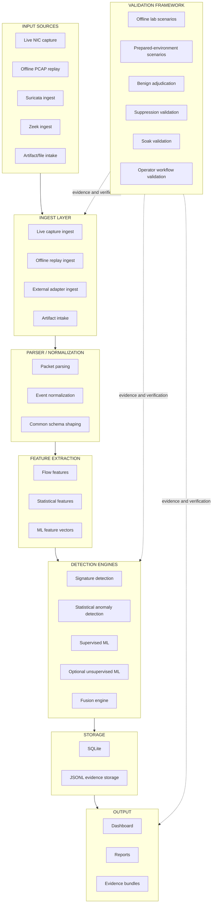

# NIDS Architecture Diagram

This figure document captures the current repository architecture in publication-ready text form. It intentionally reflects the current validated system structure and the evidence-driven validation layer that surrounds it.

## ASCII Architecture Diagram

```text
                                      +----------------------------------+
                                      |      VALIDATION FRAMEWORK        |
                                      |----------------------------------|
                                      | Offline lab scenarios            |
                                      | Prepared-environment scenarios   |
                                      | Benign adjudication              |
                                      | Suppression validation           |
                                      | Soak validation                  |
                                      | Operator workflow validation     |
                                      +----------------+-----------------+
                                                       |
                                                       v
+--------------------+      +--------------------+      +---------------------------+
|    INPUT SOURCES   | ---> |    INGEST LAYER    | ---> | PARSER / NORMALIZATION    |
|--------------------|      |--------------------|      |---------------------------|
| Live NIC capture   |      | Live capture       |      | Packet parsing            |
| Offline PCAP replay|      | Offline replay     |      | Flow normalization        |
| Suricata ingest    |      | Adapter ingest     |      | Event shaping             |
| Zeek ingest        |      | Artifact intake    |      | Common schema output      |
| Artifact/file input|      +--------------------+      +-------------+-------------+
+--------------------+                                             |
                                                                   v
                                                     +---------------------------+
                                                     |    FEATURE EXTRACTION     |
                                                     |---------------------------|
                                                     | Flow features             |
                                                     | Statistical features      |
                                                     | ML-ready feature vectors  |
                                                     +-------------+-------------+
                                                                   |
                                                                   v
                                              +-------------------------------------------+
                                              |          DETECTION ENGINES                |
                                              |-------------------------------------------|
                                              | Signature detection                       |
                                              | Statistical anomaly detection             |
                                              | Supervised ML                             |
                                              | Optional unsupervised ML                  |
                                              | Fusion engine / alert adjudication        |
                                              +------------------+------------------------+
                                                                 |
                                                                 v
                              +----------------------------------+----------------------------------+
                              |                                 STORAGE                               |
                              |------------------------------------------------------------------------|
                              | SQLite                                                                 |
                              | JSONL evidence storage                                                 |
                              +----------------------------------+----------------------------------+
                                                                 |
                                                                 v
                                  +------------------------------+------------------------------+
                                  |                             OUTPUT                            |
                                  |---------------------------------------------------------------|
                                  | Dashboard                                                      |
                                  | Reports                                                        |
                                  | Evidence bundles                                               |
                                  +---------------------------------------------------------------+
```

## Mermaid Diagram



## Figure Use Note

Use the ASCII version where monospaced diagrams are preferred and the Mermaid version where markdown rendering or conversion tooling is available.
